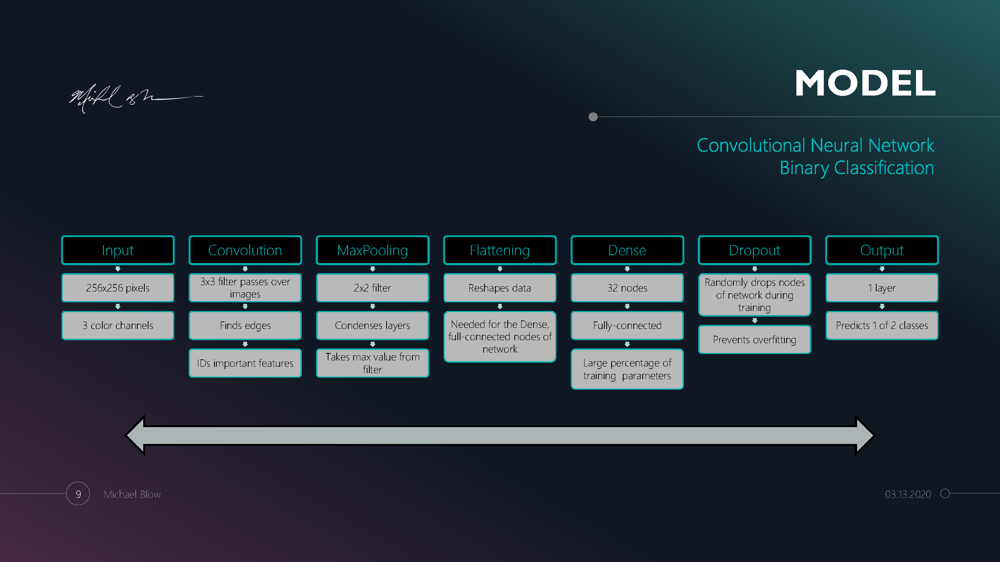

# Using Deep Learning to Accelerate Professional Photography Workflows
## Capstone Project for General Assembly's Data Science Immersive

||Michael Blow||
|:------------:|:------------:|:------------:|
|[LinkedIn](https://www.linkedin.com/in/michaeljblow/)|[Website](https://www.michaeljblow.com)|[Photography](https://mikeblow.media)|

*Special thanks on this project go out to __Chuck Dye__; without whom I may still be wondering what to do for my capstone project and how to code a convolutional neural network.*

## Problem Statement
Digital photographers often shoot thousands of images for a particular event or "gig." On average, less than 5% of images shot will be kept, post-processed, and potentially submitted to a client. A majority of images are culled or rejected (out-of-focus, mistimed, unwanted, etc.) prior to being edited and post-processed via Adobe Lightroom, Photoshop, etc. Computer vision is a complicated endeavor. Software does not know the content of new images imported from a camera.

The human eye can classify images quickly (sharp focus, landscape, portrait, too dark, too bright, etc.). However, this process requires images to be viewed and assessed individually, a time-consuming process. Time that photographers could spend editing worthy images, delivering finished products to clients, and gaining new business. In the digital age, clients are seeking delivery even faster, photographers are NOT in short supply, and those that can operate more quickly gain a competitive advantage.

## Objectives & Data
This project used my personal photography portfolio dating back to 2006 of over 54,000 images to build a convolutional neural network that identifies the category (landscapes, people, etc.) of individual images. The trained model is used by a python script (executed from the command line) to sort new images into their categories for a quicker post-processing workflow.

Neural networks are computationally intensive and analyze photos pixel by pixel. Thousands of photos from the portfolio reach as high as 45 megapixels (45.4 million pixels per image). Using all 3 color channels (RGB), this equates to over 136 million pixels per image.

The final model uses 3728 selected images (reduced to 256x256 pixels with all 3 color channels) separated into 2 classes (people and landscapes) for efficiency. 

## Target Audience
This project is aimed at photographers most-likely running their own photography business and seeking more hours in the day. This can help to gain an advantage by spending less time post-processing and delivering final products to clients. 

## Model Specifics
Convolutional neural networks are unique in their ability to handle image processing and classification. This model was a simple exploration into understanding neural network architecture and a proof-of-concept for future, more complex models. This proof-of-concept model uses 7 layers (including an input and output layer) as detailed below.

## Contents
- README - this file
- Final Neural Network Model - final_model.h5
- Model Development - final_model_development.ipynb
- Image Sorter - image_sorter.py
- Presentation

## Using this Program
The image_sorter.py script was created using Windows 10 and Git Bash. It can be run from the terminal in the directory of choice. The images to be sorted need to be in one subfolder and all in .jpg format. Once executed, images will be moved into different subfolders for landscapes or people based on how the model classifies them.

### Example
$ python image_sorter.py
$ 'Model Loaded.'
$ 'Which folder in this directory needs sorting?' test_images
$ 'Example_filename.jpg has been moved to landscapes.'

## Future Developments
Due to time constraints, the computational load of neural networks, and the amount of data being used. This model is a proof-of-concept for categorizing images during the photographic workflow. Future developments could include
- an app or Lightroom plug-in to sort images rather than through the command line.
- improving model accuracy with additional data/imagery
- Multi-class models for additional categories
- more complex models learning a photographer's style when rejecting images
- auto-culling features
